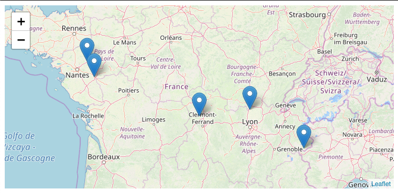

# Leaflet-vue
## An example showcase of a Vue2Leaflet map integration



## Project setup
```
yarn install
```

### Compiles and hot-reloads for development
```
yarn run serve
```

## Important Leaflet map setup steps

### [`In Main.js`](src/main.js)
- Load the Leaflet CSS file
- Add the lines related the icons file path, otherwise the markers will not show.


### [`In Map.vue`](src/components/Map.vue)
- Load the required components from the `vue2-leaflet` library in the script
- Call the components with `LMap` as parent in the template

## Vue2Leaflet Documentation
[Official quick start guide](https://vue2-leaflet.netlify.app/quickstart/)

## Vue2Leaflet Examples
[Official examples demo, with code](https://vue2-leaflet.netlify.app/examples/)
